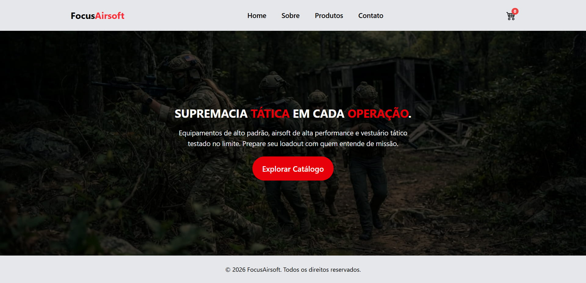

# 🔫 FocusAirsoft

O FocusAirsoft é um e-commerce simulado de equipamentos e acessórios de airsoft, desenvolvido como projeto de avaliação do meu curso. O foco principal do projeto foi a aplicação prática da arquitetura do Angular, com forte ênfase no uso de Services para gerenciamento de estado da aplicação e comunicação de dados entre componentes.

## 🚀 Tecnologias Utilizadas

-  **Angular** → Framework utilitário utilizado para a estruturação modular e componentização da loja, além do gerenciamento de rotas e injeção de dependência. Destaca-se o uso de Services como núcleo do projeto, responsáveis por centralizar o gerenciamento de estado da aplicação (como fluxo de carrinho e catálogo) e intermediar a comunicação de dados entre componentes de forma desacoplada.
-  **Tailwind CSS** → Framework utilitário de CSS utilizado para a estilização ágil dos componentes da interface.
-  **TypeScript** → Linguagem base utilizada para tipagem estática e implementação da lógica de dados dos services e componentes.

## 🖼️ Demonstração



## 🔗 Link para o Deploy

[Acesse o projeto na Vercel](https://focus-airsoft.vercel.app/)

## 🔧 Rodar localmente

Caso queira visualizar ou modificar o código localmente:

1. **Clone o repositório:**

   ```bash
   git clone https://github.com/kevinterezadev/focus-airsoft.git
   ```

2. **Acesse o diretório do projeto:**

   ```bash
   cd focus-airsoft
   ```

3. **Instale as dependências:**

   ```bash
   npm install
   ```

4. **Execute o servidor de desenvolvimento:**

   ```bash
   ng serve
   ```

5. **Navegue até `http://localhost:4200/` para visualizar o e-commerce.**

## 📄 Licença

Este é um projeto de estudo, criado com fins de aprendizado e sem fins comerciais.
